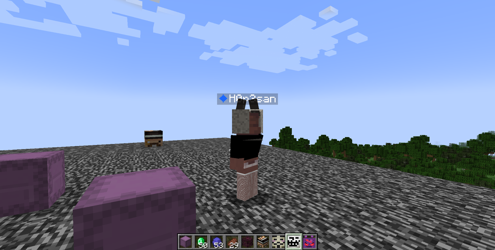
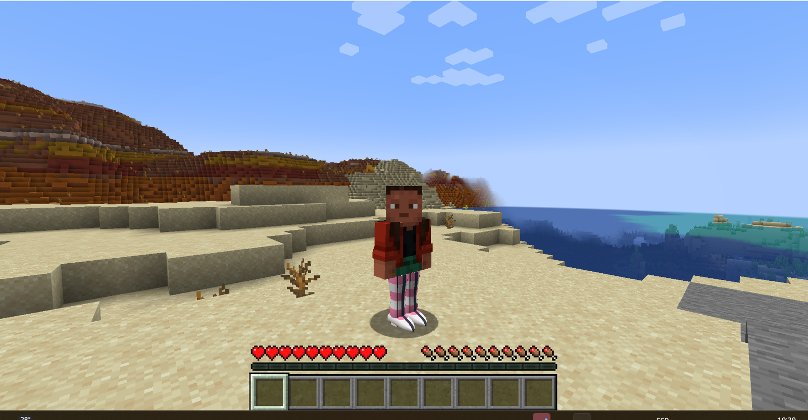
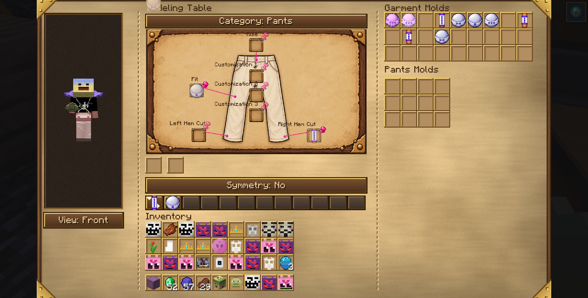
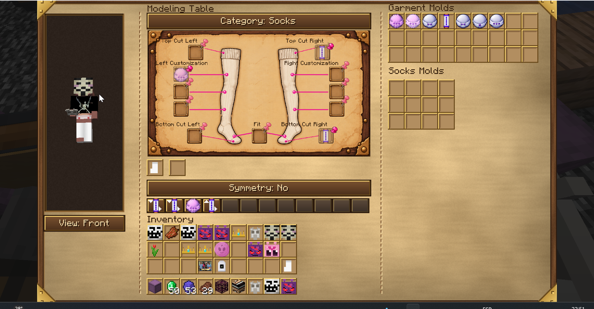
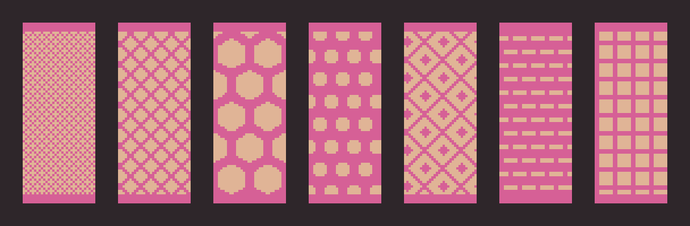
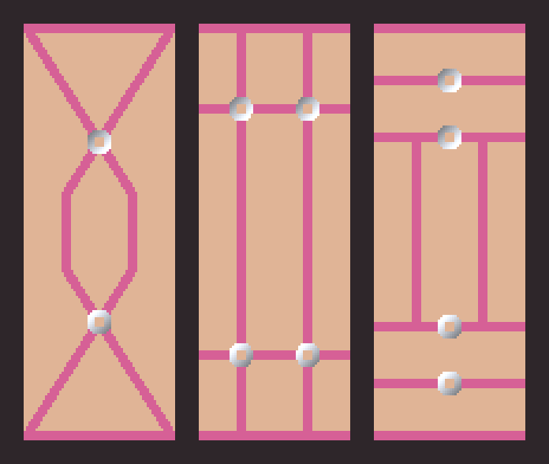
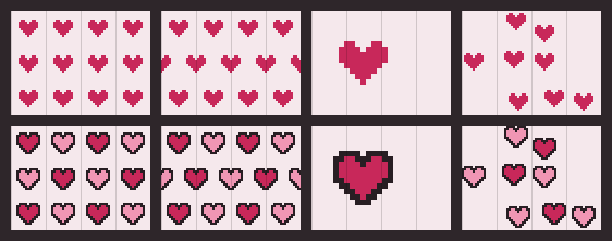
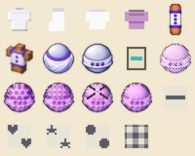

# FemClothes — Manual del mod

Versión del mod: 0.1.0 · Minecraft 1.21.1 (Fabric) · Manual actualizado: {{FECHA}}

FemClothes agrega ropa que se viste SOBRE el cuerpo del personaje: remeras, pantalones, medias, calientabrazos, polleras y capas que siguen la forma del modelo, se superponen en capas (una media debajo de un pantalón, una remera arriba de todo) y se pueden personalizar casi por completo: el corte, el color, los patrones, las estampas con fotos y hasta la trama de la tela (redes, encaje, arneses).

La personalización pasa por cuatro máquinas, cada una con su trabajo (más el Maniquí para exhibir y la Mesa de estilado para los apliques):

| Máquina | Qué hace |
|---|---|
| **Mesa de Modelado** | El CORTE: largo de mangas, de pierna, tiro, cuello, calce (holgura) y la trama (red, arnés). |
| **Estación de Tintes** | El COLOR: colores lisos o con patrones (rayas, corazones, estrellas, lunares, vichy), por zona de la prenda y mezclando capas. |
| **Sublimadora** | Las ESTAMPAS: imprime fotos (del mod Camerapture) sobre la prenda. |
| **Guardarropas** | COMBINAR prendas y guardar outfits. |
| **Maniquí** | EXHIBIR un outfit: la ropa se ve puesta en la figura, que puede girar. |
| **Mesa de estilado** | APLIQUES 3D (moño, mariposa, flor) pegados a cualquier prenda. |

## 1. Requisitos e instalación

- Minecraft **1.21.1** con **Fabric Loader** y **Fabric API**.
- **Trinkets** (obligatorio): la ropa se viste en slots de Trinkets, no en los de armadura.
- **GeckoLib** (obligatorio): las máquinas son modelos animados.
- **Camerapture** (opcional): solo hace falta para la Sublimadora (las fotos salen de ahí).
- **3D Skin Layers** (opcional): compatible; el mod ajusta la segunda capa de la skin debajo de la ropa.

Se instala como cualquier mod: el `.jar` va en la carpeta `mods` del perfil.

## 2. Primeros pasos: el recorrido completo

1. **Crafteá una prenda base** (ver Recetas): por ejemplo una remera con 8 lanas del mismo color, o unas medias con 6 lanas.
2. **Vestila:** abrí el inventario, pestaña de Trinkets, y poné la prenda en su slot (torso, piernas, medias o brazos).
3. **Cambiale el corte** en la Mesa de Modelado: poné los moldes en el dibujo de la prenda, fijalos con la chincheta, poné la prenda en la Entrada y cerrá la interfaz.
4. **Teñila** en la Estación de Tintes: elegí zonas del dibujo, poneles color y patrón, fijalos y apretá Teñir.
5. **Estampala** en la Sublimadora con una foto.
6. **Combiná** varias prendas en el Guardarropas y guardá el outfit.

Cada máquina **no consume la prenda ni los moldes**: la prenda sale modificada y los moldes y patrones se reusan para siempre. Lo que se gasta son los insumos: tinta (tintes vanilla) y papel.

## 3. Las prendas

| Prenda | Slot de Trinkets | Se modela | Se tiñe | Se estampa |
|---|---|---|---|---|
| Remera | Torso | Largo, mangas (por lado), cuello, calce, trama | Sí | Sí (frente y espalda) |
| Pantalón | Piernas (exterior) | Largo de pierna (por lado), tiro, calce, trama | Sí | Sí |
| Medias | Medias | Largo arriba y abajo (por lado), calce, trama | Sí | Sí |
| Calientabrazos | Brazos | Cobertura arriba y abajo (por lado), calce, trama | Sí | Sí |
| Pollera | Piernas (exterior) | Forma (campana o tableada), largo (6), calce, trama | Sí | Sí (frente y espalda) |
| Capa | Espalda | Largo (6), ruedo (recto o redondeado), capucha, cuello alto | Sí (exterior, forro y detalles por separado) | Sí (Frente = exterior, Espalda = forro) |
| Chaqueta (Hoodie) | Chaqueta | Igual que la remera (en las máquinas cuenta como remera) | Sí | Sí (frente y espalda) |

**Capas de dibujo.** Las prendas se dibujan en orden fijo, así una no borra a la otra: cuerpo base → medias → calientabrazos → pantalón → remera → pollera → chaqueta. Donde una prenda no tiene tela (una media corta, una remera sin mangas) se ve lo que hay abajo.

**El ícono muestra la prenda de verdad.** Los íconos de remera, pantalón, pollera, capa, medias y calientabrazos son de 64×64 y se arman con la misma tela que se ve puesta: aparecen las capas y los patrones de Tintes, cada manga o pierna con su color, las redes y los arneses, las fotos de la Sublimadora y el largo real (manga corta, crop, short, zoquete). La remera tiene un dibujo por cuello (redondo, V, polera).

**La pollera** es una malla propia que baja desde la cintura y se abre hacia el ruedo. Puede ser **campana** (lisa) o **tableada** (pliegues en V) y tiene 6 largos, del micro hasta el tobillo. **Se mueve con vos:** la tela choca con las piernas (con su forma y su pose reales: caminando, agachada, sentada o nadando, la pierna la empuja hacia afuera y nunca la atraviesa), el ruedo queda atrás al caminar o correr, se abre al caer, se achica al saltar, se balancea de costado y se retuerce un poco con cada paso (la misma inercia que usa la capa vanilla). Con `/femclothesdebug pollera rigida` queda quieta, sin piernas ni movimiento y un poco más ancha (`abierta` vuelve al modo normal; es para comparar). **Twirl:** con una pollera puesta, apretá **R** (se cambia en Controles → FemClothes → "Girar (con pollera)") y el personaje da una vuelta entera con los brazos abiertos mientras la pollera se abre casi horizontal y gira arrastrada; los demás jugadores también lo ven. Su tela tiene el mismo formato que las demás prendas, así que se tiñe con patrones y zonas, se estampa y se le puede poner red.

**La capa** cuelga de los hombros y se mueve como tela: usa la misma inercia que la capa vanilla (se levanta al correr, rebota con los saltos, se balancea de costado y se abre al agacharte), pero no es una placa rígida: arriba sigue a la espalda y se va curvando hacia el ruedo, le baja una onda al moverte, se mece un poco quieta y se abre lo necesario para no atravesar las piernas. Va en su propio slot de Trinkets, **Espalda**. Tiene 6 largos (de la cintura al tobillo), ruedo **recto** o **redondeado** (las puntas suben en arco), **capucha** caída sobre la espalda (con **H** te la ponés) y **cuello alto** abierto detrás de la cabeza; todo se elige en la Modeladora. El **forro** (la cara de adentro) se tiñe y se estampa aparte del exterior. **La del mod manda:** con una capa del mod puesta, la capa vanilla (de Minecraft o de Optifine/Minecon) no se dibuja; con élitros puestos es al revés, se ven los élitros y la del mod se esconde.

**Dónde se ponen.** En el inventario, al lado del muñeco hay una columna con tres lugares: **Remera/Chaqueta** (arriba), **Pantalón o pollera** y **Medias** (abajo). Pasando el mouse por un grupo se despliegan sus lugares. La **Capa** se abre desde el slot de la **pechera** (como los élitros) y los **Calentadores de brazo** desde el de la **mano secundaria**. Cada slot tiene un dibujito de la prenda que lleva y, vacío, al pasar el mouse dice qué va ahí, en qué capa se dibuja y cuántos lugares tiene.

**Varias prendas del mismo tipo.** Cada slot de Trinkets tiene **4 lugares**: se pueden llevar a la vez un croptop sobre un remerón largo, o medias de red debajo de unas medias cortas.

**La remera** sale en los 16 colores de lana. Su nombre cambia según el corte (croptop, musculosa, polera, remerón, remera) y el resto del corte aparece en el tooltip. Con el cuello **polera** lleva un **cuellito** alto en 3D alrededor del cuello (acanalado, del color de la remera; tapa la barbilla, no la boca).

**Chaquetas.** Categoría nueva que va **encima de la remera y de la pollera**, en su propio slot de Trinkets (**Chaqueta**, 4 lugares). La primera es el **Hoodie**: sale largo, con manga larga y calce **Oversize**, y tiene bolsillo canguro, puños y ruedo **elásticos** (la última fila aprieta y la tela hace globo arriba, sin colgar), **cordones** y **capucha**. **Capucha:** apretá **H** (Controles → FemClothes → "Subir/bajar capucha") para ponértela o bajarla; los demás lo ven. La misma tecla sube y baja la capucha de la **capa**. En las máquinas el hoodie se trata como una remera: la Modeladora le cambia largo, mangas, cuello, calce y trama con los mismos moldes, Tintes usa las zonas de la remera y la Sublimadora estampa frente y espalda (comparte los diseños guardados de la remera). La capucha y los cordones son lisos, del color base (no llevan patrones ni fotos todavía).

**Prendas viejas (armadura).** Hay prendas de una versión anterior que se equipan en los slots de armadura: Medias 3/4, Medias de Red y Traje de Maid. No pasan por las máquinas. El Buzo Oversize viejo se reemplazó por el Hoodie: su receta ahora da el nuevo y ya no aparece en la pestaña.

## 4. Cuerpo base y ropa interior

El mod dibuja un **cuerpo base** debajo de la ropa (en vez de la skin pintada), así la ropa se ve pegada al cuerpo y las zonas descubiertas muestran piel. La cabeza siempre queda con la cara de tu skin.

### Elegir cuerpo

La **primera vez que te ponés una prenda** del mod se abre la pantalla **Elegí tu cuerpo**:

- **Vista previa 3D** tuya con el cuerpo y los colores que estás eligiendo, **sin ropa** y sin la segunda capa de la skin (tampoco la de 3D Skin Layers); se gira arrastrando.
- **Cuerpos:** "Mi propia skin" (el de siempre: liso, con el tono de tu skin) y 19 cuerpos dibujados. Los humanos son Estándar, Delgado, Atlético, Musculoso, Gordito, Velludo, Fem estándar, Fem atlética, Fem con curvas y Fem gordita. Los animales son Cebra, Dálmata, Leopardo, Lobo, Osito, Panda, Tigre, Vaca y Zorro. Todos se tiñen con tu tono de piel; las manchas y rayas de los animales quedan oscuras.
- **Colores por zona:** el cuerpo tiene cuatro zonas, que salen solas del dibujo:
  - **Base:** la piel, o el pelaje en los animales.
  - **Clara:** pancita, hocico y manchas claras (solo animales).
  - **Oscura:** rayas y manchas oscuras (solo animales).
  - **Rubor:** rodillas, codos, pecho, panza y cara (los cuerpos humanos lo traen marcado en el dibujo). En automático es **tu mismo color, más intenso y un poco más oscuro**: en una piel da un rosado tibio y en una skin azul, verde o gris, un tono más profundo del mismo color, sin manchas violetas. Se puede elegir a mano, por ejemplo un rosa. Con la zona Rubor elegida aparece el slider **Fuerza del rubor** (0 a 100%, de a 5; arranca en 50%): en 0 no hay rubor.

  Click en una zona para editarla. La Base arranca **calculada de tu skin** (**Tono de mi skin** la vuelve a eso). Clara, Oscura y Rubor arrancan en **automático**: salen del color Base, más claras u oscuras solas (marcadas con una "A"). El botón **Automática** las devuelve a ese estado.
- **Ropa interior** (debajo de la vista previa), en dos partes que se eligen por separado: **↑ arriba** (Nada arriba, Bralette, Deportivo, Binder) y **↓ abajo** (Slip, Culotte, Boxer). Click pasa a la siguiente. La muestra de color de al lado elige su **color** en los sliders y la paleta (con la "A" es el blanco roto de siempre). La tela toma el relieve del cuerpo. El binder tapa y da la forma de la faja, pero no achata: para pecho plano, elegí un cuerpo plano. La ropa interior es el mínimo que siempre está; lo personalizable (encaje, patrones, fotos) se hace con remeras y pantalones recortados en las máquinas.
- **Usar siempre como mi skin** (debajo de la grilla): con **Sí**, el cuerpo elegido, con sus colores y su ropa interior, se ve siempre, aunque no tengas ropa del mod puesta (la segunda capa de tu skin se oculta, salvo el sombrero y la capa). Con **No**, aparece solo debajo de la ropa del mod.
- Con un cuerpo elegido, la cadera (de la cintura para abajo) también es del cuerpo; con "Mi propia skin" ahí se sigue viendo tu skin real.
- **De tu skin:** una paleta con hasta **5 colores sacados de tu skin** (los más usados, sin repetir parecidos). Click en uno lo pone en la zona elegida; por ejemplo, con una skin de osito, el marrón del pelaje en Base y el beige de la pancita en Clara. Los sliders Rojo/Verde/Azul ajustan la zona a mano.
- **Confirmar** lo guarda y la pantalla ya no vuelve a aparecer sola. **Ahora no** la cierra sin guardar y vuelve a aparecer la próxima vez que entres al mundo.

Los cuerpos dibujados están en alta resolución (6 veces la de una skin común). Cada uno está pintado para brazos anchos (classic) o finos (slim). Si tu skin tiene los otros, la textura se adapta sola; tus brazos no cambian de ancho.

### Comandos

Sin permisos especiales, cada quien cambia el propio:

| Comando | Qué hace |
|---|---|
| `/femclothes elegir` | Vuelve a abrir la pantalla Elegí tu cuerpo. |
| `/femclothes cuerpo <tipo>` | Cambia el cuerpo directo: `skin_real`, `estandar`, `delgado`, `atletico`, `musculoso`, `gordito`, `velludo`, `fem_estandar`, `fem_atletica`, `fem_curvas`, `fem_gordita`, `cebra`, `dalmata`, `leopardo`, `lobo`, `osito`, `panda`, `tigre`, `vaca`, `zorro`. Los cuerpos viejos (plano, curvy, binder) pasaron a Estándar y Fem con curvas. |
| `/femclothes interior arriba <tipo>` | Parte de arriba: `ninguna`, `bralette`, `deportivo`, `binder`. |
| `/femclothes interior abajo <tipo>` | Parte de abajo: `slip`, `culotte`, `boxer`. |
| `/femclothes interior color <rgb>` | Color de la ropa interior, como número (ej. `16777215` = blanco). |
| `/femclothes tono skin` | Tono de piel tomado de tu propia skin (el valor por defecto). |
| `/femclothes tono <número>` | Tono de piel a mano, como color RGB en decimal (ej. 14329120). |
| `/femclothes ver` | Muestra tu configuración actual. |
| `/femclothes reset` | Vuelve todo al valor por defecto. |

## 5. Cómo funcionan las máquinas (común a todas)

Las tres máquinas de confección (Modelado, Tintes, Sublimadora) comparten la misma lógica:

- **Configuración y fijadas.** En la interfaz armás el ajuste y lo **fijás** (con la chincheta o un botón). Lo fijado es lo que se aplica; lo que no está fijado es solo un borrador que se ve en la vista previa.
- **Vista previa 3D.** La columna izquierda muestra a tu personaje con la prenda como va a quedar. Se gira arrastrando con el mouse o con el botón Vista (frente, costado, espalda), y se hace zoom con la ruedita.
- **Diseños guardados.** Escribís un nombre y apretás **Guardar diseño**: se guarda todo lo fijado de esa prenda (hasta 8 diseños por prenda, en las tres máquinas). Click en un casillero numerado lo carga (el nombre aparece al pasar el mouse); click derecho lo borra.
- **Entrada y salida.** Cada máquina tiene un slot grande de **Entrada** (la prenda a procesar) y uno de **Salida** (la prenda terminada). Mientras trabaja, la máquina se anima y hace ruido; al terminar suena una campanita. La pantallita del frente está **siempre iluminada** y da una luz tenue (nivel 4); trabajando o con la prenda lista (LED rojo o verde), la máquina ilumina más fuerte (nivel 10). La barrita de progreso del frente, sobre fondo negro, se llena de izquierda a derecha y queda llena mientras la prenda terminada espera en la salida.
- **Colores de cada máquina.** Las tres interfaces son de pergamino y madera, pero cada una tiene su metal: la Estación de Tintes es **verdosa** (verdín), la Modeladora **cobriza** y la Sublimadora **dorada**. El color se ve en los filos, las esquinas, los slots y los botones.
- **La prenda en el bloque.** La prenda cargada se ve sobre la máquina con su ícono real (el mismo del inventario, con colores, patrones y estampas): acostada sobre la mesa en la Modeladora y la Sublimadora, y enrollada alrededor del rodillo de Tintes (gira con él mientras tiñe y queda ahí hasta que la retirás). La pantallita del frente muestra también ese ícono.
- **Tiempos.** Modelado 15 s, Tintes 10 s, Sublimadora 15 s.
- **¡Cuidado!** Meter la mano (click derecho) en una máquina mientras trabaja lastima: la Modeladora corta, la de Tintes marea con los vapores y la Sublimadora quema.
- **Al romperlas se guardan enteras** (como una shulker box, a pedido del 2026-09-30): el ítem que cae lleva TODO lo de adentro — prendas, moldes, pines, cuadraditos, diseños guardados, fotos, papel, tinta y hasta el trabajo a medias — y al volver a colocarla queda igual. Vale para las 4 (Modeladora, Tintes, Sublimadora y Guardarropas), rotas a mano o por una explosión. En creativo, como la shulker, cae solo si tiene algo adentro.

### Automatización con tolvas

Las máquinas se pueden encadenar con tolvas (hoppers):

| Cara del bloque | Qué entra o sale |
|---|---|
| **Arriba** | La prenda a procesar (entra sola y arranca sola). |
| **Atrás** | Los insumos: tintes (C, M, Y, K) y papel. |
| **Derecha** | La prenda terminada sale sola hacia un cofre o tolva de ese lado. |

Con tolva, la prenda **arranca sola** si hay un diseño fijado. Desde la interfaz, las tres tienen un botón sobre la flecha Entrada → Salida: **Modelar**, **Teñir** y **Prensar**. Además, la Modeladora arranca al cerrar la interfaz (solo si hay prenda en la Entrada, algo fijado y la Salida libre; si no, queda apagada) y la Sublimadora al cerrar la tapa. *(La cadena completa de máquinas todavía no se probó a fondo.)*

## 6. Mesa de Modelado

La Modeladora cambia el **corte** de la prenda. En el centro está el **dibujo de la prenda** con cuadraditos (pines) en cada parte: cuello, mangas, largo, tiro, botamangas, etc. Cada pin acepta los moldes que tienen sentido ahí.

**Cómo se usa:**

1. Elegí la prenda con el botón **Categoría** (remera, pantalón, medias, calientabrazos, pollera, capa).
2. Arrastrá un **molde** al pin que quieras cambiar.
3. Apretá la **chincheta** del pin: el corte queda fijado y el molde vuelve al almacén. En el pin queda un ícono fantasma del molde fijado.
4. Click en la chincheta de un pin fijado lo quita.
5. Poné la prenda en la **Entrada** y apretá **Modelar** (el botón sobre la flecha), o **cerrá la interfaz**: la máquina se enciende sola y empieza a producir. Modelar solo se habilita con prenda en la Entrada, algún corte fijado y la Salida libre. Mientras está encendida (sin estar produciendo), un click en el bloque la apaga.

**Simetría (remera):** con simetría activada, soltar un molde en cualquiera de las dos mangas fija las dos iguales. Sin simetría, cada manga tiene su propio largo.

**Almacén:** a la derecha hay un almacén general de moldes (27 lugares) y uno por prenda, "Moldes de <prenda>" (36 lugares, 9×4), para tener los moldes de cada categoría a mano.

### Pines por prenda

| Prenda | Pines |
|---|---|
| Remera | Cuello, Manga Izq., Manga Der., Corte inferior (largo), Calce, 3 de Materiales (patrones y redes) |
| Pantalón | Tiro, Corte Bota Izq., Corte Bota Der., Calce, 3 de Materiales |
| Medias | Corte Superior e Inferior de cada pierna, Calce, 3 de Personalización por lado |
| Calientabrazos | Corte Superior e Inferior de cada brazo, Calce, 3 de Personalización por lado |
| Pollera | Forma (molde de pollera), Largo (molde de rango), Calce, 3 de Materiales |
| Capa | Largo (molde de rango), Ruedo, Capucha y Cuello (moldes de capa), 3 de Materiales |

### Los moldes

| Molde | Dónde va | Qué hace |
|---|---|---|
| **Molde de rango** (Mínimo, Corto, Medio, Medio largo, Largo, Máximo) | Mangas, botas, cortes sup./inf., largo de pollera | Hasta dónde llega la tela. Sirve para todas las prendas: cada una lo traduce a su propia medida (una manga "corta" llega al codo, una media "corta" es un zoquete). |
| **Molde de torso** (Corto, Medio, Largo) | Corte inferior de remera, Tiro de pantalón | Largo de la remera (crop, normal, largo) o altura del tiro. |
| **Molde de cuello** (Redondo, V, Polera) | Cuello de remera | Forma del cuello. |
| **Molde de manga** | Activo (remera, calientabrazos) | Molde viejo de manga: cada uso pasa al largo siguiente. |
| **Molde de calce** (Pegado, Ajustado, Normal, Suelto, Oversize) | Calce | Qué tan despegada del cuerpo va la prenda. |
| **Molde de pollera** (Campana, Tableada) | Forma de la pollera | Pollera lisa en campana o tableada con pliegues. |
| **Moldes de capa** (Ruedo recto, Ruedo redondeado, Con capucha, Sin capucha, Cuello alto, Sin cuello) | Ruedo, Capucha y Cuello de la capa | Cada uno en su pin. Los "Sin" le sacan la capucha o el cuello a una capa que ya los tiene. |
| **Molde de red** | Materiales / Personalización | La trama de la tela (ver abajo). |
| **Molde de corte** | Activo | Un combo de cortes guardado en un solo ítem. |

**Los cinco calces:**

| Calce | Cómo queda |
|---|---|
| Pegado | Reemplaza la piel: la tela va justo donde estaba la skin. |
| Ajustado | Aprieta: donde hay tela el brazo, la pierna o el torso quedan más finos (medio píxel menos), y la piel de afuera sigue normal, así se nota el escalón donde corta la prenda. |
| Normal | Un poco holgado: un cuarto de píxel de aire. |
| Suelto | Más holgado, se abre hacia el ruedo (el puño, la botamanga, el borde de la remera) y cuelga 1 píxel por debajo de donde corta. |
| Oversize | Muy grande, se abre el doble hacia el ruedo y cuelga 2 píxeles. |

Las capas se respetan siempre: una prenda de arriba nunca queda por dentro de una de abajo (se corre apenas hacia afuera solo donde se superponen). Un pantalón largo no cuelga por debajo del pie, y la pollera no aprieta por dentro del cuerpo.

**Cómo funcionan los cortes de extremidades.** En medias, calientabrazos y pantalón, el largo son **dos anclajes que se cruzan**: el corte superior dice desde dónde arranca la tela y el inferior hasta dónde llega. Así se arman desde zoquetes hasta medias hasta el muslo, o calientabrazos que solo cubren el antebrazo.

### Redes y arneses (trama de la tela)

El molde de red **perfora** la tela ya teñida: deja ver la piel por los agujeros y refuerza solo los bordes (cuello, puños, dobladillo, el borde del largo elegido) para que la prenda no se vea deshilachada.

| Molde | Cómo se ve |
|---|---|
| **Red fina** | Malla diagonal chica y apretada. |
| **Red gruesa** | Malla diagonal grande, bien abierta. |
| **Red hexagonal** | Panal de abejas. |
| **Red perforada** | Tela sólida con agujeritos redondos, tipo broderie. |
| **Encaje** | Rombos grandes con un punto en el centro. |
| **Rayas caladas** | Franjas horizontales abiertas, con puentes alternados. |
| **Escocesa** | Cuadrícula recta. |
| **Arnés cruzado** | Tiras en X por cara con un anillo plateado en el cruce. |
| **Arnés de tirantes** | Dos tirantes verticales y una banda al medio, anillos en los cruces. |
| **Arnés de bandas** | Bandas horizontales con un anillo cada una. |
| **Textura lisa** | Quita la red que tuviera la prenda. |

**Arneses.** Son lo contrario de una red: todo queda abierto salvo las tiras. Las tiras siguen los bordes de corte reales, así que si acortás la remera a crop, el arnés se acomoda solo. En la remera, las tiras pasan por los **hombros** y empalman siempre con el frente y la espalda. En las mangas y calientabrazos que llegan al hombro, el **hombro** (la tapa de arriba del brazo) lleva el mismo dibujo del arnés que los costados (la X con su anillo, los tirantes o las bandas) más un marco que empalma con cada tira que sube por el brazo. Los anillos son plateados y no se tiñen; las tiras toman el color de la prenda.

## 7. Estación de Tintes

La Estación de Tintes pinta la prenda. En el bloque, la pantallita del frente muestra la prenda cargada, con el mismo marco y tamaño que en la Modeladora y la Sublimadora. Funciona por **cuadraditos**: el dibujo de la prenda (el mismo de la Modeladora) tiene un cuadradito por zona, y **cada cuadradito es una capa de color** con su propia configuración.

> *Captura pendiente: la interfaz de Tintes cambió después de las últimas capturas.*

### Tinta

La máquina usa tinta **CMYK** (cian, magenta, amarillo y negro), que se carga con los tintes vanilla correspondientes: click derecho con el tinte en la mano, o por tolva desde atrás. Cada tanque guarda hasta 64 dosis. Cada teñido gasta **una dosis de cada canal** que use alguno de los colores fijados. Cuánta tinta queda se ve **dentro de cada slider C/M/Y/K**: el fondo del slider se llena con el color de la tinta según lo cargado y a la derecha dice `n/64` (en rojo si está vacío).

Cada color se arma con 5 sliders de 0 a 100% en pasos de 5%: **Cyan, Magenta, Yellow, Key** (negro) y **Transparencia**. La transparencia no gasta tinta: al 100% hace un **recorte** (un agujero en la tela) y entre medio deja la tela **calada**, con un tramado fino de puntitos abiertos que se lee como tul. Va por color, así se puede, por ejemplo, calar solo los corazones de un patrón. Las muestras con transparencia se ven con fondo a cuadros.

### Muestras de color

Para guardar un color o pasárselo a otra persona (2026-09-30): **Envasar** (debajo de la muestra grande) gasta un **frasco de vidrio** de tu inventario y te da una **Muestra de color** con la mezcla que estás editando. El frasquito toma ese color y su tooltip dice el código y los porcentajes C/M/Y/K/T. **Usar muestra** copia la mezcla de la muestra que tenés agarrada con el cursor (o, si no, de la primera que haya en tu inventario) al color que estás editando. La muestra es solo la receta del color: no trae tinta y no se gasta al usarla. En creativo, envasar no pide frasco.

### Los cuadraditos

| Prenda | Cuadraditos de zona | Cuadraditos de prenda entera |
|---|---|---|
| Remera | Cuello (solo el borde del escote), Manga Izq., Manga Der. (incluyen el hombro), Pecho (el del medio: todo el cuerpo y la parte de arriba), Borde inferior | Los dos de arriba a los costados |
| Pantalón | Cintura (Tiro), Bota Izq., Bota Der. | Los 3 de Materiales |
| Medias | Superior e Inferior de cada pierna | Los 6 de Personalización |
| Calientabrazos | Superior e Inferior de cada brazo | Los 6 de Personalización |
| Pollera | — | 3 (fila fija) |
| Capa | Exterior, Forro, Capucha y cuello (fila fija) | — |

Las zonas cubren también las **tapas** de cada pieza (la parte de arriba del torso va con el Pecho, la de abajo con el Borde inferior; la planta de la media y la punta del calientabrazos con Inferior), y los patrones de prenda entera cruzan el hombro de adelante hacia atrás sin cortarse. El **Cuello** sigue la forma real del molde de cuello (redondo, en V) y siempre se pinta arriba del Pecho.

En medias y calientabrazos, el dibujo se lee **de frente**: el cuadradito de la izquierda del dibujo es la pierna o brazo **derecho** del personaje (igual que en la Modeladora).

### Cómo se usa

1. Elegí la prenda con **Categoría**.
2. **Click en un cuadradito** para seleccionarlo (queda con marco dorado). Los sliders y botones editan ese cuadradito.
3. Poné un **molde de patrón** en el cuadradito si querés patrón. **Sin molde, la capa es un color liso** en esa zona.
4. Elegí el color con los **sliders CMYK** (a la derecha, con la muestra del color).
5. Apretá la **chincheta** del cuadradito para **fijarlo**:
   - con molde: queda fijado con ese patrón y el molde vuelve al **almacén** (30 lugares, en la columna izquierda debajo de Guardar diseño);
   - sin molde: queda fijado como color liso;
   - si ya estaba fijado y no tiene molde: se desfija.
6. Poné la prenda en la **Entrada** y apretá **Teñir** (el botón sobre la flecha).

Debajo de cada cuadradito que participa aparece una tira con su color. La vista previa muestra **exactamente lo fijado** más el cuadradito que estás editando (si ese no está fijado, la línea "Editando" dice *sin fijar*: no va a salir en la prenda). Si ponés un molde nuevo en un cuadradito que ya estaba fijado, se usa ese molde sin tener que volver a clavar la chincheta.

**Resaltado en 3D.** Con el mouse encima de un cuadradito del dibujo (o de su chincheta, o de su fila en el panel de capas), la vista previa **apaga todo lo que no es su zona**: lo demás de la prenda se oscurece y la zona queda con su color real. En los cuadraditos de prenda entera no se apaga nada.

Al teñir, el **ícono** del ítem toma el color de la capa lisa de prenda entera que quede más arriba (el ícono no muestra patrones).

### Panel de capas

Abajo a la derecha hay una **lista de las capas** que participan (las fijadas más la que estás editando), ordenadas como se pintan: **la de arriba de la lista tapa a las de abajo**. Cada fila muestra:

| Parte de la fila | Qué hace |
|---|---|
| **Ojo** | Click para ocultar o mostrar la capa. Una capa oculta **sigue fijada** y se guarda en los diseños, pero **no se aplica al teñir, no gasta tinta y no sale en la vista previa**. Si todas las fijadas están ocultas, Teñir avisa que no hay nada para aplicar. |
| **Muestra** | Los colores de la capa (una franja por color). |
| **Nombre** | Zona y patrón (o "liso"). En cursiva si todavía no está fijada. Click selecciona la capa, igual que tocar su cuadradito. |
| **▲ ▼** | Sube o baja esa capa en el orden de pintado (y la selecciona). |

La fila de la capa seleccionada tiene marco dorado. Pasar el mouse por una fila resalta su zona en la vista previa.

### Controles de cada cuadradito

| Control | Qué hace |
|---|---|
| **Mezcla** | Normal (tapa lo de abajo), Multiplicar (oscurece: ideal para un patrón sobre otros colores), Superponer (contraste). |
| **Opacidad** | De 10% a 100%. |
| **▼ Capa n/N ▲** | El orden de pintado: más arriba tapa a las de abajo. Por defecto, las de prenda entera van abajo y las de zona arriba. Es el mismo orden del panel de capas. |
| **Tamaño** | Extra chico a Extra grande. |
| **Ángulo** | Gira las rayas en pasos de 15°. En un patrón de motivos gira **toda la grilla** (como girar la tela): con 45° los corazones quedan en filas diagonales. |
| **Giro** | Solo motivos (corazones, estrellas, lunares): gira **cada motivo en su lugar**, de a 15°, sin mover la grilla. |
| **↔ / ↕** (sliders) | Distancia horizontal y vertical entre motivos, de **50 %** (pegados, o apenas superpuestos) a **300 %** (el triple de la separación normal), de a 5 %. En las rayas es la distancia entre rayas: el ↕ separa las horizontales y el ↔ las verticales (las diagonales mezclan los dos). Con la grilla girada, el motivo que cae en la costura de atrás puede no empalmar. |
| **Espejo** | Solo motivos: da vuelta cada motivo, izquierda↔derecha (↔), arriba↔abajo (↕) o los dos. |
| **Alternar** | Solo motivos: de por medio el motivo sale espejado — por **filas**, por **columnas** o en **damero**. Con **Giro** arma un zigzag tipo tejido (una fila inclinada para un lado, la siguiente para el otro). |
| **Simetría** | En el torso (remera, hoodie, pollera), la mitad izquierda es el reflejo de la derecha, espejada en el centro del frente y de la espalda: las rayas en diagonal quedan en **V** y los motivos se enfrentan. Brazos y piernas ya salen espejados solos. |
| **Posición** | Corre el patrón (rayas: la franja; motivos: la grilla o el logo). |
| **Forma / Repetición** | Con rayas: Alternado, Arriba, Abajo, Medio, Tres rayas. Con motivos: Grilla, Ladrillo, Disperso, Único. |
| **Azar** | Nueva tirada al azar (posiciones de Disperso y colores de Variación: Aleatorio). |
| **Invertir** | Pinta el negativo del patrón. |

### Varios colores en una capa

A la derecha, sobre la muestra grande, hay **tres muestras de color**: click en una elige cuál editan los sliders (si estaba apagada, se prende).

| Control | Qué hace |
|---|---|
| **Colores: 1 / 2 / 3** | Cuántos colores usa la capa. |
| **Contorno** | Una línea alrededor de cada motivo o raya, con el **último** color activo (necesita al menos 2 colores). |
| **Variación: Fijo** | Todo el relleno del Color 1. |
| **Variación: Alternar** | Cada motivo, raya o cuadro toma el color siguiente. |
| **Variación: Aleatorio** | Cada uno toma un color al azar (Azar vuelve a sortear). |
| **Variación: Degradé** | Pasa de un color al otro de arriba a abajo. Funciona también en capas lisas, sin molde. |

Ejemplos: corazones rojos y rosas alternados con contorno negro (3 colores, Contorno sí, Alternar); una remera en degradé (cuadradito de prenda entera, sin molde, 2 colores, Degradé); rayas multicolor (Alternar con 3 colores).

### Patrones

| Molde de patrón | Tipo |
|---|---|
| Rayas superiores, Rayas alternadas, Tres rayas | Rayas (la forma se cambia con el botón Forma) |
| Corazones, Estrellas, Lunares | Motivos repetidos |
| Vichy | Cuadros de tres tonos con un solo color (los cruces más oscuros) |

**Repeticiones de motivos:** **Grilla** (filas parejas), **Ladrillo** (cada fila corrida media posición), **Disperso** (al azar, con huecos; Azar cambia la tirada), **Único** (un motivo grande en el frente de cada pieza, tipo logo; Posición lo sube o baja). Los motivos se reparten para que entren justo alrededor de la pieza: el que cae en la costura de atrás sigue del otro lado sin cortarse.

## 8. Sublimadora

La Sublimadora **imprime fotos** del mod Camerapture sobre remeras, pantalones, medias, calientabrazos, polleras y capas (en la pollera, Frente y Espalda cubren cada mitad de la campana; en la capa, Frente es el exterior y Espalda el forro).

> *Captura pendiente: la interfaz se rehízo el 2026-09-28 con el mismo estilo que Tintes y la Modeladora.*

**La interfaz** tiene el mismo esqueleto que sus hermanas:

| Zona | Qué hay |
|---|---|
| **Izquierda** | Vista previa 3D, botón Vista, nombre y **Guardar diseño**. |
| **Centro** | **Categoría**; el dibujo de la prenda dos veces, **Frente** y **Espalda**, cada una con su slot de foto y su chincheta; el cinturón **Entrada → Salida** con **Prensar** sobre la flecha; los 8 casilleros de diseño; y los controles de la cara elegida: **Escala**, **Posición X**, **Posición Y**, **Ángulo** y **Cara**, más **Simetría** en medias y calientabrazos. |
| **Derecha** | Los tanques de tinta **C, M, Y, K** y el de **papel** con su nivel (n/64), la guía de pasos y el **almacén** de 27 fotos (3 filas). Al romper la máquina, todo queda guardado adentro del ítem. |

El dibujo muestra la prenda que está en la Entrada, con su color. Si no hay ninguna, muestra la prenda terminada de la Salida, y si tampoco, una de la categoría elegida.

**Cómo se usa:**

1. Elegí la prenda con **Categoría** (o poné una en la Entrada: la categoría la sigue sola).
2. Poné una foto en el slot de **Frente** o de **Espalda**. **Tocar un slot de foto elige esa cara**: los controles de abajo editan esa cara, que queda con marco dorado.
3. Ajustá **Escala**, **X**, **Y** y **Ángulo**. A escala mínima la foto queda chica y centrada, tipo logo; a escala máxima cubre la prenda entera (full print), recortada a la silueta.
4. Clavá la **chincheta** de cada cara que quieras imprimir. **Solo se estampan las caras fijadas que tienen foto**. La vista previa muestra lo fijado más la cara que estás editando; la línea "Editando" dice si esa cara está fijada.
5. Poné la prenda en la **Entrada** y apretá **Prensar**: la tapa baja y arranca. Cerrar la tapa a mano también arranca.

**Detalles:**

- **Insumos:** tinta CMYK (tintes vanilla, hasta 64 por tanque) y **papel** (hasta 64). Cada cara estampada gasta una dosis de cada color; cada prensado gasta una hoja de papel. Las fotos **no se consumen**: quedan cargadas para reimprimir.
- **Simetría lateral (medias y calientabrazos):** las dos piernas (o brazos) llevan la misma foto. Con **Simetría: No** llevan la misma copia; con **Simetría: Sí**, la izquierda lleva el **espejo** de la derecha, así un logo corrido hacia afuera queda hacia afuera en las dos. Ojo: un texto en la foto se lee al revés en el lado espejado.
- **Diseños guardados:** como en las otras máquinas, nombre + Guardar diseño y 8 casilleros por categoría: guardan el ajuste de las dos caras, cuáles están fijadas y la simetría. Click carga, click derecho borra. Las "fijadas" de la versión anterior pasaron a ser diseños "#1", "#2"...
- **Prensado:** 15 segundos, con vapor, pitidos y LED rojo; al terminar, LED verde y campanita.
- Frente y espalda se pueden estampar en una sola pasada. No pisa una cara ya estampada: una prenda con el frente hecho puede volver a entrar para imprimirle la espalda.
- Las fotos con transparencia (PNG) funcionan.

## 9. Guardarropas

El Guardarropas sirve para **combinar prendas**: tiene 4 lugares por categoría (remera, pantalón/pollera, medias, calientabrazos, chaqueta) y una columna de **armadura** (casco, pechera, pantalones, botas), así se pueden probar juntas varias prendas del mismo tipo (un croptop sobre un remerón, un pantalón con una pollera y una calza), con vista previa. **Guardar outfit** y **Equipar** guardan y se ponen la combinación, armadura incluida (lo que tenías puesto en ese lugar vuelve a tu inventario; un lugar vacío no te saca nada). La vista previa muestra también la armadura.

Es un mueble con puerta: se pone de frente a quien lo coloca y la puerta se abre hacia afuera mientras alguien tiene la pantalla abierta.

*El sistema de estilos guardados todavía está en construcción.*

### Maniquí

Exhibe un outfit completo. Mide casi dos bloques (necesita lugar libre arriba para ponerlo). Tiene los mismos lugares que el Guardarropas (4 por categoría de prenda + la columna de armadura) y **todo se ve puesto en la figura**, en el mundo.

- **Click derecho con una prenda o una pieza de armadura:** se la pone (la prenda en el primer lugar libre de su categoría; la armadura en su lugar, si está libre).
- **Click derecho con la mano vacía:** abre la pantalla.
- **Agachado con la mano vacía**, o botón **Girar/Detener:** el plato gira (una vuelta cada 14 segundos) y se detiene donde está.
- **Intercambiar conmigo:** la ropa y la armadura del maniquí pasan a vos y las tuyas al maniquí, lugar por lugar. No se pierde nada.
- **Pose:** el botón pasa por Parado, En jarra, Saludo, Brazos abiertos, Pasarela y Sentado (sentado, la figura baja y se apoya en el plato). Los **sliders** de la derecha mueven cabeza, brazos y piernas por separado (adelante/atrás y abrir); al tocar uno la pose pasa a **Libre**.
- **Figura:** *maniquí* (liso, color madera) o *tu skin* (la de quien aprieta el botón; al ponerlo se guarda la de quien lo colocó).
- **Armadura:** se ve como en un jugador (teñido del cuero, trims y brillo de encantamiento). La calabaza, las cabezas y los bloques van en la cabeza. Los élitros todavía no se dibujan.
- Al romperlo, todo cae al piso.

Las medias se ven sin el volumen extra de pierna que tienen en el jugador. Con calce Pegado o Ajustado la figura se afina en esa parte para que la tela no quede adentro.

### Mesa de estilado

Pone **apliques 3D** (moño, mariposa, flor) sobre cualquier prenda del mod. Click derecho abre la pantalla (herrajes lila):

- **Tres slots** arriba a la derecha: **Prenda**, **Molde** de aplique (la forma: moño, mariposa o flor; **no se gasta**) y **Retazo** de aplique (los **3 colores** del aplique; se gasta **uno por aplique**, hasta 64 en el slot).
- **Vista 3D grande** a la izquierda con tu personaje vistiendo solo esa prenda. **Click izquierdo sobre la tela** = ahí queda el aplique, mirando hacia afuera de la cara tocada (con "arriba" hacia la cabeza). Una cruz marca dónde caería. **Click derecho y arrastrar** gira la vista (también los botones ⟲ ⟳).
- **Lista de apliques** (hasta **6 por prenda**): click en uno lo elige (otra vez lo suelta). Con uno elegido: **Giro** `<` `>` de a 15°, **Tamaño** `<` `>` de 50 % a 250 % de a 25 %, y **Quitar**, que devuelve un retazo con sus mismos colores.
- Si falta algo, el texto de abajo avisa qué (prenda, molde, retazo, prenda llena, click fuera de la tela).

Los apliques viajan en la prenda (componente `femclothes:apliques`) y se ven en el jugador, en el Maniquí y en el Guardarropas, siguiendo la pose de la parte donde están (brazo, pierna, cabeza o torso) y por fuera del calce de la prenda.

**Colores.** Cada modelo tiene 3 zonas: moño = alas / nudo / colas; mariposa = alas de arriba / alas de abajo y lunares / cuerpo y antenas; flor = pétalos / centro / hojas. Por ahora los colores salen del retazo (lisos); en creativo hay tres retazos de muestra. Más adelante la Estación de Tintes va a teñir retazos con patrones, y los apliques van a tener física (colas, alas, pétalos).

## 10. Comandos

**Para todos los jugadores** (cambian solo tu apariencia): ver la sección 4, `/femclothes elegir`, `cuerpo`, `interior`, `tono`, `ver`, `reset`.

**Para operadores** (afectan a todo el servidor):

| Comando | Qué hace |
|---|---|
| `/femclothes debug instantaneo` | Las máquinas terminan al instante (la tinta y el papel se siguen gastando igual). |
| `/femclothes debug normal` | Vuelve a los tiempos reales. |
| `/femclothes debug ver` | Muestra en qué modo está. |
| `/femclothes debug patrones` | Te da shulker boxes con uno de cada molde de patrón. |
| `/femclothes debug moldes` | Te da shulker boxes con uno de cada molde de corte y de red (son 30: van en 2 shulkers). |
| `/femclothes debug insumos` | Te da una shulker con 64 de cada uno de los 16 tintes y 64 de papel. |
| `/femclothes debug kit` | Moldes, patrones e insumos de una sola vez. |

**Del cliente** (solo cambian lo que VOS ves, para probar):

| Comando | Qué hace |
|---|---|
| `/femclothesdebug skin` | Cicla skins de prueba (Steve, Alex, Zuri, Noor, Kai) y la tuya. |
| `/femclothesdebug slim` / `ancho` / `automodelo` | Fuerza brazos finos, anchos, o los de la skin. |
| `/femclothesdebug reset` | Vuelve a tu skin. |
| `/femclothesdebug pollera abierta` / `rigida` | Abierta: la pollera choca con las piernas y se mueve con el cuerpo. Rígida: quieta, sin piernas ni movimiento, más ancha. Solo para vos, para comparar. |

## 11. Recetas

| Ítem | Receta |
|---|---|
| Remera (16 colores) | 8 lanas del mismo color: `L _ L / L L L / L L L` |
| Medias Color Pleno (16 colores) | 6 lanas del mismo color: `L _ L / L _ L / L _ L` |
| Pantalón | 5 lanas blancas: `L _ L / L L L` |
| Calentadores de Brazo | 2 lanas blancas, una arriba de la otra |
| Medias 3/4 (armadura) | 4 lanas blancas: `L _ L / L _ L` |
| Medias de Red (armadura) | 4 hilos: `H _ H / H _ H` |
| Traje de Maid (armadura) | 8 lanas blancas alrededor de 1 lana negra |
| Hoodie (chaqueta) | 8 lanas blancas: `L L L / L L L / L _ L` (la receta del Buzo Oversize viejo) |
| Mesa de Modelado | 3 papeles, hilo + tijeras + hilo, 3 tablones de roble |
| Sublimadora | Hierro alrededor, un pistón en el medio y un horno abajo |
| Molde de manga | Papel + hilo (sin forma) |
| Rayas alternadas | Papel / hilo / papel (filas) |
| Rayas superiores | Hilo / papel / papel (filas) |
| Tres rayas | Hilo / hilo / papel (filas) |

**Sin receta todavía (solo en creativo o con `/femclothes debug`):** Estación de Tintes, Guardarropas, Maniquí, Mesa de estilado, Pollera, moldes de rango, torso, cuello, calce, red, arnés, pollera y capa, molde de corte, la Capa, y los patrones de corazones, estrellas, lunares y vichy.

Todo el contenido del mod está en su propia pestaña del inventario creativo: **FemClothes**.

## 12. Estado y pendientes

Funciones planeadas que todavía no están:

- Volumen 3D real en la ropa (integración con 3D Skin Layers).
- Cadena de máquinas por tolvas, probada de punta a punta.
- Guardarropas: sistema de estilos guardados.
- Mesa de estilado: retazos teñidos con patrones en Tintes, física de los apliques, más modelos (bijouterie, chokers) y recetas.
- La ropa en el brazo en primera persona.
- Piernas redondeadas opcionales (versión 2).
- Recetas para los ítems que hoy son solo de creativo.

# Anexo técnico

Esta parte es para quien quiera entender o extender el mod.

## A. Organización del código

| Paquete | Contenido |
|---|---|
| `item` | Prendas, moldes de patrón, componentes de datos (`FemclothesComponents`), redes (`PatronRed`). |
| `modelado` | Mesa de Modelado: bloque, block entity, pantalla, moldes de corte, `ComboCorte`, `PrendaModelado` (aplica un corte a una prenda). |
| `tinturas` | Estación de Tintes: cuadraditos (`Casilla`), capas, diseños, teñido. |
| `sublimadora` | Sublimadora, remera y su `Variante` (largo/manga/cuello), estampas (`EstampaTextures`). |
| `guardarropas` | Guardarropas (modelo GeckoLib `wardrobe`, puerta por `OPEN`); `categoriaDe` reparte prendas en las 4 categorías y lo comparte el Maniquí. |
| `maniqui` | Maniquí: 16 slots sincronizados al cliente, giro del plato calculado en el cliente (`ManiquiRenderer` gira el hueso `turntable` y la ropa con el mismo ángulo) y ropa dibujada con `GarmentFeatureRenderer.dibujarTela` sobre un modelo de jugador slim a escala 0.6. |
| `estilado` | Mesa de estilado: block entity con prenda/molde/retazo, pantalla y `PonerApliquePayload`. |
| `aplique` | Apliques: `Aplique` (componente), `ModeloAplique`, molde y retazo. |
| `bloque` | Genéricos de GeckoLib por nombre de asset: `ModeloGeo` (geo/atlas/animación) y `BloqueGeoItem` (ítem dibujado con la malla del bloque). |
| `region` | Lado (izq./der./ambas), regiones de pintura (`RegionPintura`), `RegionResolver` (lee y escribe capas y colores por lado), `ModoMezcla`. |
| `render` | Composición de texturas (`ClothingTextureCache`), geometría (`CuerpoGeometria`, layout de skin a 8x), generador de patrones (`PatronGenerador`, `Motivo`, `Repeticion`, `Variacion`), el renderer único de ropa (`GarmentFeatureRenderer`). |
| `body` | Cuerpo base (`CuerpoBase`: las 19 máscaras en gris de `textures/entity/cuerpo/`, en HD de 384×384, multiplicadas canal por canal por el tono en `CuerpoBaseTextures`), ropa interior (`RopaInterior` = `InteriorArriba` + `InteriorAbajo` + color; texturas grises `interior_arriba_*`/`interior_abajo_*` de `tools/generar_ropa_interior.py`, teñidas y sombreadas con la máscara en `CuerpoBaseTextures.superponer`), perfil por jugador (`PerfilCuerpo.elegido`), comandos y paquetes de la GUI de elegir cuerpo (`RedCuerpo`). La GUI es `client/ElegirCuerpoScreen` y el disparador `ElegirCuerpoCliente`. |
| `client` | Pantallas, vista previa 3D, estilo pergamino, piezas de cada prenda (`PiezasDelMod`). |

## B. Cómo se dibuja una prenda

1. `GarmentFeatureRenderer` junta todo lo que el jugador tiene puesto en Trinkets y lo dibuja desde un solo lugar, ordenado por **capa** (`Capa`), sobre el cuerpo base.
2. Cada prenda devuelve sus **piezas** (`PiezasDelMod`): qué parte del cuerpo cubre, en qué capa, con qué textura y qué filas de la caja son visibles (así se recortan largos sin generar un archivo por cada largo).
3. La textura se **compone en tiempo real** sobre un atlas con el layout de la skin a escala 8x (512×512) y se cachea por combinación: color base, capas de color, estampas, recorte y red.
4. **Pollera y capa van aparte**, con malla propia: `PolleraMalla` en el marco del torso y `CapaMalla`, una cadena de 16 tramos (`doblar`) que parte de la inercia de `CapeFeatureRenderer` (`CapaMalla.movimiento`), se curva hacia el ruedo, ondea y se abre para no atravesar las piernas (`PolleraMalla.Piernas` llevado al marco de la capa). La tela de la capa (`capa_tela.png`) usa el layout del cuboide de la capa vanilla (10×16×1 en uv 0,0: exterior u 1..11, forro u 12..22) más una caja de detalles 12×8×2 en uv 24,0 para capucha y cuello; `PatronGenerador` la pinta como las cajas `CAPA` y `CAPA_DETALLES` y las zonas son `RegionPintura.CAPA_EXTERIOR/CAPA_FORRO/CAPA_DETALLES`. `PlayerEntityCapasSkinMixin` apaga la capa vanilla (`isPartVisible(CAPE)`) mientras haya una del mod y no haya élitros.

**Apliques.** `render/ApliqueRenderer` dibuja los `.geo.json` de GeckoLib (`tools/generar_apliques.py`: miran a −Z, espalda en z = 0, atlas de 96×32 con una columna de 32 px por zona) recorriendo huesos y cubos a mano, en la misma pila de matrices que la ropa: `ModelPart.rotate` de la parte, el punto del click corrido hacia afuera por la dilatación del calce, y una base (derecha, arriba, atrás) que apunta −Z a la normal de la cara. El atlas se tiñe por columna y se cachea por terna de colores. La Mesa ubica el click invirtiendo la matriz de cada parte que guarda `GarmentFeatureRenderer.capturaPoses` durante el render de la vista previa (rayo de pantalla contra la caja de la pieza, cara de salida = la que se ve).

**Máquinas que se guardan enteras.** `util/DropMaquina`: los 4 bloques sobreescriben `getDroppedStacks` (romper a mano y explosiones) y devuelven el ítem con todo el NBT del block entity en `minecraft:block_entity_data` más sus componentes (la tinta); `BlockItem` lo vuelve a cargar al colocarla. Ya no hay loot tables ni `onStateReplaced` que desparrame. En creativo, `onBreak` tira el ítem si la máquina no está vacía.

## C. Capas de color (Estación de Tintes)

Cada capa es un `RegionResolver.CapaPatron` guardado en la lista `femclothes:capas_tinte` de la prenda: patrón opcional (sin patrón = liso), color principal y extras, tamaño, ángulo, posición, forma, invertido, región, modo de mezcla, opacidad, repetición, semilla, contorno, variación y la distribución (`DistribucionPatron`: giro de cada motivo, distancias horizontal/vertical, espejo, espejo alternado y simetría del torso). Las capas viejas de la Modeladora (componentes `pattern_*`, con variantes `right_*` para el lado derecho) se siguen leyendo.

Las capas **ocultas** del panel (`Casilla.oculta`, NBT `Oculta`) no entran en `TinturasBlockEntity.capasDe`, así que no se aplican ni gastan tinta.

**Resaltado de la vista previa.** `prendaDeVistaPrevia(resaltada)` le suma a la copia de la vista previa una capa "velo": lisa, negra, Multiplicar al 60%, con `fueraDeRegion = true`. Ese flag (que no está en el codec, nunca se guarda) hace que `CapaMascara.cobertura` pinte todo lo de AFUERA de la región en vez de adentro.

Al componer, cada pixel parte del color base de la tela y cada capa se **funde** encima (`ClothingTextureCache.mezclar`) según su cobertura, su modo y su opacidad.

**Canales de la máscara.** Las máscaras de patrón (`PatronGenerador`) guardan en cada pixel todo lo necesario para elegir el color al componer, sin generar una máscara por combinación de colores:

| Canal | Contenido |
|---|---|
| Alfa | Cobertura 0–255 (el vichy usa 128 en las franjas simples). |
| Rojo | Bit 7: es contorno. Bits 0–6: valor al azar de esa repetición. |
| Verde | Número de repetición (para Alternar). |
| Azul | Altura dentro de la pieza, de 0 arriba a 255 abajo (para Degradé). |

## D. Cómo agregar contenido

- **Un motivo nuevo:** agregar el dibujo (filas de `X` y `.`) en el enum `Motivo`, registrar un `ClothingPatternItem` con ese motivo en `FemclothesItems`, y sumar ícono, modelo, traducción y entrada en la pestaña (`Femclothes.PESTANA`).
- **Una red nueva:** agregar el valor al **final** del enum `PatronRed` (el orden viaja por red), su `Dibujo` y la lógica en `ClothingTextureCache.esHilo` (o `perforarArnes` si es un arnés), y registrar el `MoldeRedItem` en `ModeladoMod`.
- **Una prenda nueva:** registrar el ítem, declarar su `Garment` en `PrendasDelMod`, sus piezas en `PiezasDelMod`, y el slot de Trinkets si hace falta uno nuevo.

## E. Compilar y probar

- `gradlew build` genera el `.jar` en `build/libs/`.
- Para probar: copiar el `.jar` a la carpeta `mods` del perfil **con el juego cerrado**.
- Los fondos de interfaz de pergamino se generan con `tools/generar_textura_modelado.py`, `generar_textura_tinturas.py` y `generar_textura_sublimadora.py` (este último reusa las funciones del de Tintes). Los íconos de las prendas salen de `tools/generar_iconos_prendas.py`: por prenda, un `_sombra.png` (silueta y relieve) y un `_mapa.png` (de qué cara del cuerpo y de qué punto se saca cada píxel) en `textures/item/icono/`; `IconoPrenda` los combina en Java con las texturas de `PiezasDePrenda`, recorta las filas que la pieza no tapa y pone el contorno. El color de cada máquina sale de `TEMAS`/`aplicar_tema` (verdín, cobre, oro), con los mismos valores que `EstiloPergamino.Tema` usa para los botones.
- Este manual se genera con `python tools/generar_manual.py`, que arma las imágenes y convierte `docs/manual/MANUAL.md` en `docs/manual/FemClothes_Manual.docx`.
